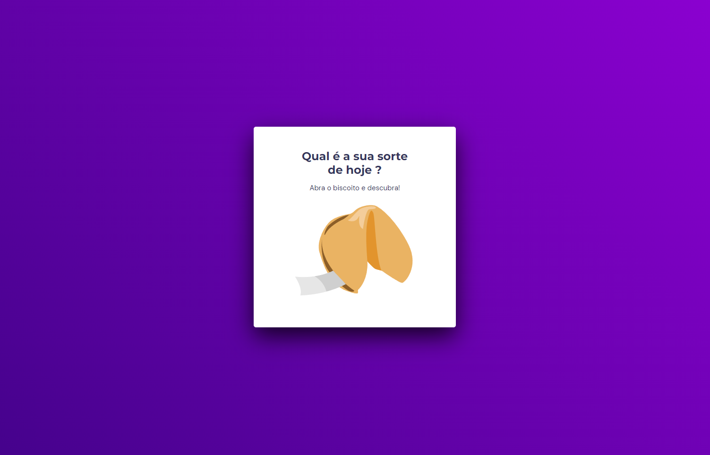
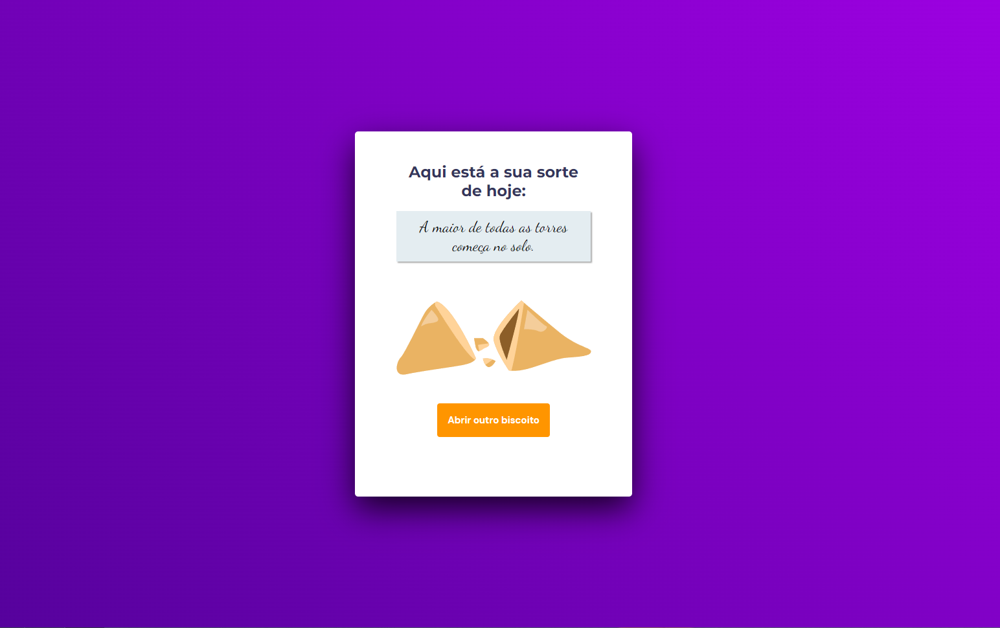

<h1 align="center"> Fortune Cookie </h1>

Aplicação desenvolvida no Stage 05 do programa Explorer da Rocketseat.

  <a href="#-tecnologias">Tecnologias</a>&nbsp;&nbsp;&nbsp;|&nbsp;&nbsp;&nbsp;
  <a href="#-projeto">Projeto</a>&nbsp;&nbsp;&nbsp;|&nbsp;&nbsp;&nbsp;
  <a href="#-layout">Layout</a>&nbsp;&nbsp;&nbsp;|&nbsp;&nbsp;&nbsp;
  <a href="#memo-licença">Licença</a>

  

 

  

  

## 🚀 Tecnologias

Esse projeto foi desenvolvido com as seguintes tecnologias:

- HTML e CSS 
- JavaScript
- Git e Github

## 💻 Projeto

Biscoito da sorte que ao ser aberto com um clique, revela um frase de sorte.

## 🔖 Layout

Você pode visualizar o layout do projeto através [DESSE LINK](<https://www.figma.com/file/v99oKHXBLDC5tTzvaZcTwX/Biscoito-da-Sorte-(Community)?type=design&node-id=0-1&mode=design&t=451E52I7KxzCV9K7-0>). É necessário ter conta no [Figma](https://figma.com) para acessá-lo.

## :memo: Licença

Esse projeto está sob a licença MIT.

---